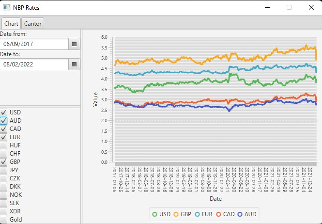
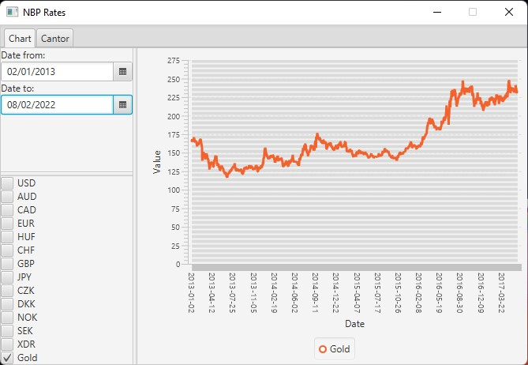
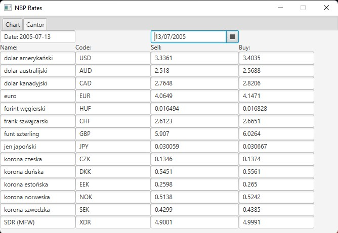

# NBP Rates
Java GUI application that shows currency exchange rates and gold prices published by NBP (Polish National Bank)).

The application consists of two tabs.  
Tab 1 - Chart  
This tab is plotting a chart for currency exchange rates and gold prices in the selected period.  
Tab 2 - Cantor  
This tab presents a table with the selling and buying prices of different currencies on the chosen day.   

Screenshots:  

 <!-- -->

 <!-- -->

 <!-- -->
